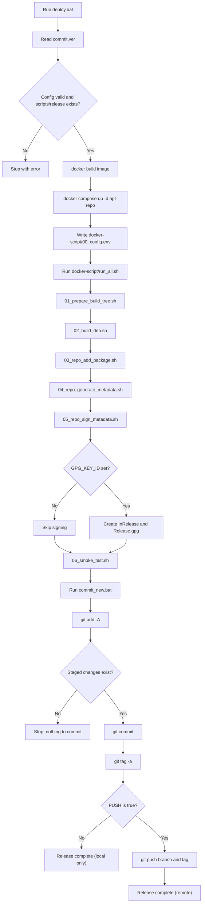
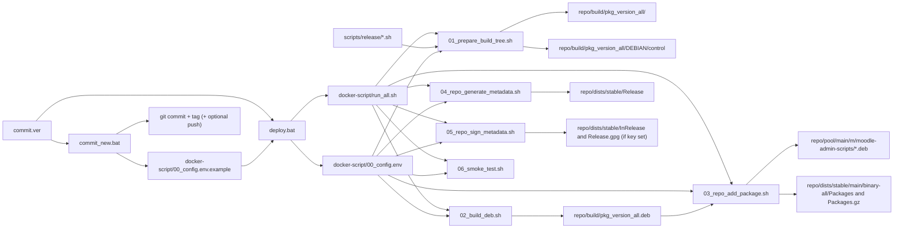
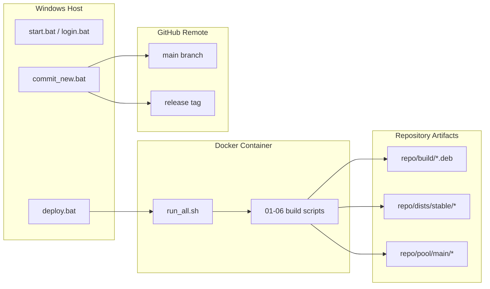
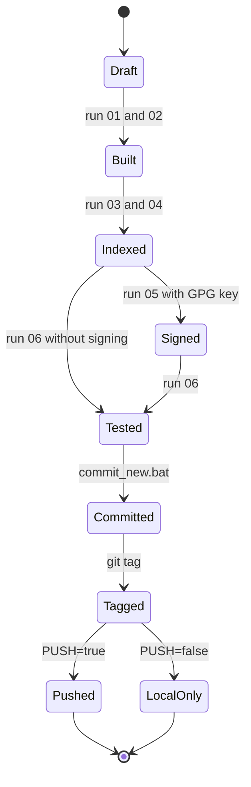

# map.md

This file is the visual map of how this repository builds and releases the APT package.

## 1) End-to-End Release Workflow

## 2) Script/Data Read-Write Flow

## 3) Swimlane View (Who Runs What)

## 4) Release Lifecycle States

