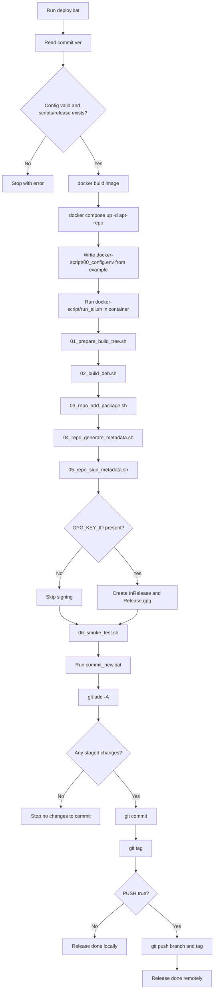

# map.md

This file maps the full repository workflow and all tracked files.

## 1) End-to-End Release Workflow


## 2) Script/Data Read-Write Flow
```mermaid
flowchart LR
  A1[commit.ver] --> A2[deploy.bat]
  A1 --> A3[commit_new.bat]
  A4[docker-script/00_config.env.example] --> A2
  A2 --> A5[docker-script/00_config.env]
  A2 --> A6[docker-script/run_all.sh]
  A6 --> B1[docker-script/01_prepare_build_tree.sh]
  A6 --> B2[docker-script/02_build_deb.sh]
  A6 --> B3[docker-script/03_repo_add_package.sh]
  A6 --> B4[docker-script/04_repo_generate_metadata.sh]
  A6 --> B5[docker-script/05_repo_sign_metadata.sh]
  A6 --> B6[docker-script/06_smoke_test.sh]
  C1[scripts/release/*.sh] --> B1
  B1 --> C2[repo/build/.../usr/local/share/*.sh]
  B1 --> C3[repo/build/.../usr/local/bin/* symlinks]
  B1 --> C4[repo/build/.../DEBIAN/control]
  B2 --> D1[repo/build/*.deb]
  D1 --> B3
  B3 --> D2[repo/pool/main/.../*.deb]
  B3 --> D3[repo/dists/stable/main/binary-all/Packages(.gz)]
  B4 --> D4[repo/dists/stable/Release]
  A5 --> B5
  B5 --> D5[repo/dists/stable/InRelease and Release.gpg]
  A3 --> A4
  A3 --> E1[git commit and tag]
```

## 3) Full Repository Tree (All tracked files)


## 4) Suggested Additional Visuals
- A lane diagram with 4 lanes: Windows Host, Docker Container, Repo Files, GitHub Remote.
- A state diagram for release lifecycle: Draft -> Built -> Indexed -> Signed -> Tested -> Committed -> Tagged -> Pushed.
- A dependency heatmap (table) mapping each packaged script to required binaries (bash, mysql, php, apachectl, tar, etc.).
- A Graphviz/PNG export pipeline so every commit can regenerate visuals automatically.
